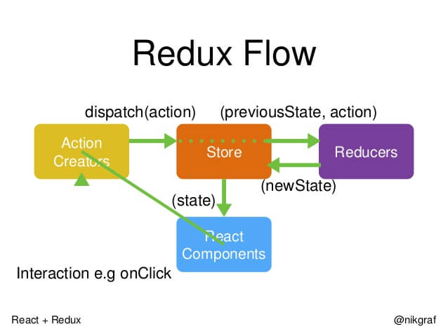

## React

### 组件通信

- 父子组件props传递
- 自定义事件
- Redux和Context

### 生命周期

当外部的 `props` 改变时，如何再次执行请求数据、更改状态等操作—re-render阶段进行二次更新

使用 `componentWillReceiveProps`

### 数据共享 `redux` 及 原理

在React中，数据在组件中是单向流动的，数据从一个方向父组件流向子组件（通过props）,所以，两个非父子组件之间通信就相对麻烦，redux的出现就是为了解决state里面的数据问题

 

- view
    - action
        - dispatch
            - reducer
                - state
                    - view
                    

Redux是将整个应用状态存储到一个地方上称为**`store`**,里面保存着一个状态树**store tree**,组件可以派发(`dispatch`)行为(`action`)给store,而不是直接通知其他组件，组件内部通过订阅**store**中的状态**`state`**来刷新自己的视图。

发布订阅模式



### React可以在render中访问ref吗?

React提供的这个`ref`属性，**表示为对组件真正实例的引用，其实就是`ReactDOM.render()返回的组件实例`**；需要区分一下，`ReactDOM.render()`渲染组件时返回的是组件实例；而渲染dom元素时，返回是具体的dom节点。

当 ref 对象内容发生变化时，useRef 并不会通知你。变更 `.current` 属性不会引发组件重新渲染。如果想要在 React 绑定或解绑 DOM 节点的 ref 时运行某些代码，则需要使用 `callback ref` 来实现。

不要在组件的`render`方法中访问`ref`引用，`render`方法只是返回一个虚拟dom，这时组件不一定挂载到dom中或者render返回的虚拟dom不一定会更新到dom中。

### State和Props有什么区别?

- `setState()`会对一个组件的 `state` 对象安排一次`更新`。当 `state` 改变了，该组件就会重新`re-render`渲染

**区别:**

`props（“properties” 的缩写）`和 `state` 都是普通的 `JavaScript` 对象。它们都是用来保存信息的，这些信息可以控制组件的渲染输出，而它们的几个重要的不同点就是：

- `props` 是传递给组件的（类似于函数的形参），而 `state` 是在组件内被组件自己管理的（类似于在一个函数内声明的变量）。
- `props` 是不可修改的，所有 `React` 组件都必须像纯函数一样保护它们的 `props` 不被更改。 由于 `props` 是传入的，并且它们不能更改，因此我们可以将任何仅使用 `props` 的 `React` 组件视为 `pureComponent`，也就是说，在相同的输入下，它将始终呈现相同的输出。
- `state` 是在组件中创建的，一般在 `constructor`中初始化 `state`
- `state` 是多变的、可以修改，每次`setState`都异步更新的。

### **react 中 ref 是干什么用的，有哪些使用场景**

1. 挂到组件（这里组件指的是有状态组件）上的ref表示对组件实例的引用，
2. 挂载到dom元素上时表示具体的dom元素节点取得深层次的dom的结构。进行操作
主要是对表格滚动条的操作
3. 默认情况下，**你不能在函数组件上使用 `ref` 属性**，因为它们没有实例
    1. 如果要在函数组件中使用 `ref`，你可以使用 `[forwardRef](https://zh-hans.reactjs.org/docs/forwarding-refs.html)`（可与 `[useImperativeHandle](https://zh-hans.reactjs.org/docs/hooks-reference.html#useimperativehandle)` 结合使用），或者可以将该组件转化为 class 组件

### **React 中，cloneElement 与 createElement 各是什么**

```jsx
React.cloneElement(
  element,
  [props],
  [...children]
)

React.createElement(

  type,
  [props],
  [...children]
)
```

直接上 API，很容易得出结论：首参不一样。这也是他们的最大区别：

1. `cloneElement`，根据 Element 生成新的 Element
2. `createElement`，根据 Type 生成新的 Element

然而，此时估计还是云里雾里，含糊不清，需要弄清它，首先要明白俩概念

1. Type
2. Element

### Hooks 与 class 组件的区别

- 没有生命周期
- 没有实例
- 没有state

### 你在开发过程中使用 hook 遇到过的痛点是什么

每次 render 都有一份新的状态，数据卡在闭包里，捕获了每次 render 后的 state，也就导致了输出原来的 state

调用 `setState` 其实是异步的 —— 不要指望在调用 `setState` 之后，`this.state` 会立即映射为新的值。

如果你需要基于当前的 `state` 来计算出新的值，那你应该传递一个函数fun，而不是一个对象obj。

### setState初始化值,只有第一次有效

- render —>`初始化state的值` - re-render—>`只恢复初始化的值`,不会再重新设置新的值, - `只能用setName修改`
- 因为useState的更新函数会直接替换老的state，所以我们在对`对象`或者`数组`的state做增删的时候不能像以前直接对数组使用push，pop，splice等直接改变数组的方法
    - 使用数组解构生成一个新数组，在数组后面加上我们新增的随机数达成数组新增项，使用filter数组过滤方法来实现我们删除其中项的操作
        
        ```jsx
        setCounts([
              ...counts,
              randomCount
            ])
        // 使用数组filter方法，过滤删除其中不需要的项
            setCounts(counts.filter((count, index) => index !== counts.length - 1))
        setCounts(counts => {
              const randomCount = Math.round(Math.random()*100)
              // 简单使用JSON.parse及JSON.stringify深拷贝一个新的数组和对象(实际项目中建议自己写递归深拷贝函数)，然后对其操作返回
              let newCounts = JSON.parse(JSON.stringify(counts))
              newCounts.push(randomCount)
              return newCounts
            })
        
        ```
        

### useEffect内部不能修改state

- `setState`在`useEffect`中无法起到作用?为什么
- useEffect第二个参数为空数组的时候，组件更新时“`会引用到先前渲染中的旧变量`”，具体实现猜测是useEffect`保存`了`内部引用`的参数
    - 没有依赖时候,re-render会重新执行`effect函数`
    - `useEffect`中使用`setState`
    - setState用于渲染dom的时候，会触发useEffect，从而触发循环，导致内存耗尽
- `每次 render 都有一份新的状态，数据卡在闭包里`，捕获了每次 render 后的 state，也就导致了输出原来的 state
- 可以通过 useRef 来保存 state。
    - ref 在组件中只存在一份，无论何时使用它的引用都不会产生变化，因此可以来解决闭包引发的问题。
    
    **调用顺序跟pureFun组件关联**
    
- 函数组件,纯函数,`执行完即刻销毁`
- 组件初始化 || `re-render`
    - 都会`重新执行一次fun组件`,获取最新的组件
    - 和class组件的不同—class组件局`有实例,组件不销毁,实例一直再`

### useMemo 和 useCallback 区别

- `useCallback`用来缓存函数
    
    父组件给`子组件传递参数`为`普通函数`时，父组件每次更新子组件都会更新，但是大部分情况子组件更新是没必要的，这时候我们用`useCallback`来定义函数，并把这个函数传递给子组件，子组件就会根据依赖项再更新了
    
    - `父组件更新`,函数进行重载—>子组件被迫渲染
    - useCallback进行缓存n,不更新子组件方法
- `useMemo`缓存数据
    
    `useMemo`可以初略理解为Vue中的计算属性`computer`，在依赖的某一属性改变的时候自动执行里面的计算并返回最终的值(并缓存，依赖性改变时才重新计算)，对于性能消耗比较大的一定要使用useMemo不然每次更新都会重新计算
    
    - 父组件更新,根据数据依赖—选择性的—渲染子组件
    - 使用场景
        - 作为props传递的函数，集合memo一起使用；
        - 作为更新触发的依赖项 主要目的是为了避免高昂的计算和不必要的重复渲染

### 手写 useState， useEffect
### hooks的性能优化有哪些方式

若出现十几或几十个 `useState` 的时候，可读性就会变差，这个时候就需要相关性的组件化了。以逻辑为导向，抽离在不同的文件中，借助 `React.memo` 来屏蔽其他 `state` 导致的 `rerender`。

```jsx
const Position = React.memo(({ position }: PositionProps) => {
  // position 相关逻辑
  return (
    <div>{position.left}</div>
  );
});
```

因此在 `React hooks` 组件中尽量不要写流水线代码，保持在 200 行左右最佳，通过组件化降低耦合和复杂度，还能优化一定的性能。

```jsx
function Counter() {
  const [count, setCount] = React.useState(0);

  function increment() {
    setCount((n) => n + 1);
  }
  return <ChildComponent count={count} onClick={increment} />;
}
```

`hooks` 的写法已经埋了一个坑。在 `count` 状态`更新`的时候， `Counter` 组件会重新执行，这个时候会重新创建一个新的函数 `increment`。这样传递给 `ChildComponent` 的 `onClick` 每次都是一个新的函数，从而导致 `ChildComponent` 组件的 `React.memo` 失效。

解决办法:

```jsx
function usePersistFn<T extends (...args: any[]) => any>(fn: T) {
  const ref = React.useRef<Function>(() => {
    throw new Error('Cannot call function while rendering.');
  });
  ref.current = fn;
  return React.useCallback(ref.current as T, [ref]);
}

// 建议使用 `usePersistFn`
const increment = usePersistFn(() => {
  setCount((n) => n + 1);
});

// 或者使用 useCallback
const increment = React.useCallback(() => {
  setCount((n) => n + 1);
}, []);
```

上面声明了 `usePersistFn` 自定义 `hook`，可以保证函数地址在本组件中永远不会变化。完美解决 `useCallback` 依赖值变化而重新生成新函数的问题，逻辑量大的组件强烈建议使用。

不仅仅是函数，比如每次 `render` 所创建的新对象，传递给子组件都会有此类问题。尽量不在组件的参数上传递因 `render` 而创建的对象，比如 
```
style={{ width: 0 }} 
```
此类的代码用 `React.useMemo` 来优化。

```jsx
const CustomComponent = React.memo(({ width }: CustomComponentProps) => {
  const style = React.useMemo(() => ({ width } as React.CSSProperties), [width]);
  return <ChildComponent style={style} />;
});

```

`style` 若不需改变，可以提取到组件外面声明。尽管这样做写法感觉太繁琐，但是不依赖 `React.memo` 重新实现的情况下，是优化性能的有效手段。


### 为什么 hook 不能写在 if & for循环

判断里 hooks在初始化时候是以`链表形式存储`的，后续`更新`都是按照这个`链表顺序`执行的 hooks的基本模式原理–>`闭包+链表`

### react设计理念及原理 UI=fn(state)

### 什么是单一数据流，为什么要这样做

单向数据流（Unidirectional data flow）方式使用一个上传数据流和一个下传数据流进行双向数据通信，两个数据流之间相互独立。单向数据流指只能从一个方向来修改状态。

与单向数据流对对应的是双向数据流（也叫双向绑定）。在双向数据流中，Model（可以理解为状态的集合） 中可以修改自己或其他Model的状态， 用户的操作（如在输入框中输入内容）也可以修改状态。这使改变一个状态有可能会触发一连串的状态的变化，最后很难预测最终的状态是什么样的。使得代码变得很难调试

### 

### 如果没有redux，让你去设计一个全局状态管理，你会怎样去实现（看下 useModel的实现）

useContext ➕ useReducer

### **React 中 fiber 是用来做什么的**

因为JavaScript单线程的特点，每个同步任务不能耗时太长，不然就会让程序不会对其他输入作出相应，React的更新过程就是犯了这个禁忌，而React Fiber就是要改变现状。 而可以通过分片来破解JavaScript中同步操作时间过长的问题。

把一个耗时长的任务分成很多小片，每一个小片的运行时间很短，虽然总时间依然很长，但是在每个小片执行完之后，都给其他任务一个执行的机会，这样唯一的线程就不会被独占，其他任务依然有运行的机会。

React Fiber把更新过程碎片化，每执行完一段更新过程，就把控制权交还给React负责任务协调的模块，看看有没有其他紧急任务要做，如果没有就继续去更新，如果有紧急任务，那就去做紧急任务。

维护每一个分片的数据结构，就是Fiber。

### **redux 和 mobx 有什么不同**

[https://juejin.cn/post/6924572729886638088](https://juejin.cn/post/6924572729886638088)

Redux更多的是遵循函数式编程（Functional Programming, FP）思想，而Mobx则更多从面相对象角度考虑问题。

store是应用管理数据的地方，在Redux应用中，我们总是将所有共享的应用数据集中在一个大的store中，而Mobx则通常按模块将应用状态划分，在多个独立的store中管理。

Redux默认以JavaScript原生对象形式存储数据，而Mobx使用可观察对象：

1. Redux需要手动追踪所有状态对象的变更；
2. Mobx中可以监听可观察对象，当其变更时将自动触发监听；

### 虚拟dom & diff

- 虚拟 DOM 最大的优势在于**抽象了原本的渲染过程**，实现了`跨平台`的能力，而不仅仅局限于浏览器的 DOM，可以是安卓和 IOS 的原生组件，可以是近期很火热的小程序，也可以是各种 GUI。
- vdom 把渲染过程抽象化了，从而使得组件的抽象能力也得到提升，并且可以适配 DOM 以外的渲染目标。
- Virtual DOM 在牺牲(牺牲很关键)部分性能的前提下，增加了可维护性，这也是很多框架的通性。 实现了对 DOM 的集中化操作，在数据改变时先对虚拟 DOM 进行修改，再反映到真实的 DOM中，用最小的代价来更新DOM，提高效率(提升效率要想想是跟哪个阶段比提升了效率，别只记住了这一条)。
- 打开了函数式 UI 编程的大门。
- 可以渲染到 DOM 以外的端，使得框架跨平台，比如 ReactNative，React VR 等。
- 可以更好的实现 SSR，同构渲染等。这条其实是跟上面一条差不多的。
- 组件的高度抽象化。

> 虚拟 DOM 的缺点
> 
- 首次渲染大量 DOM 时，由于多了一层虚拟 DOM 的计算，会比 innerHTML 插入慢。
- 虚拟 DOM 需要在内存中的维护一份 DOM 的副本(更上面一条其实也差不多，上面一条是从速度上，这条是空间上)。
- 如果虚拟 DOM 大量更改，这是合适的。但是单一的，频繁的更新的话，虚拟 DOM 将会花费更多的时间处理计算的工作。所以，如果你有一个DOM 节点相对较少页面，用虚拟 DOM，它实际上有可能会更慢。但对于大多数单页面应用，这应该都会更快。

### react中 为什么使用合成事件

- 提供`统一的 API`，`抹平`各大浏览器差异
- 合成事件 所有事件绑定在 `React Root Element` 进行事件委托

### setState到底是同步还是异步，（可能会出个解读题）

```jsx
componentDidMount() {
        this.setState({ count: this.state.count + 1 })
        console.log("1", this.state.count)
        this.setState({ count: this.state.count + 1 })
        console.log("2", this.state.count)
        setTimeout(() => {
            this.setState({ count: this.state.count + 1 })
            console.log("3", this.state.count) //2
        })
        setTimeout(() => {
            this.setState({ count: this.state.count + 1 })
            console.log("4", this.state.count) //3
        })
    }
```

### [React/Vue 中受控组件与不受控组件的区别](https://zhuanlan.zhihu.com/p/353706108)

- 受控组件的状态由开发者维护
- 非受控组件的状态由组件自身维护（不受开发者控制）

```jsx
// 受控组件
<Input value={x} onChange={fn}/>

// 非受控
<Input defaultValue={x} ref={input}/>
```
